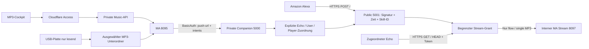

# Alexa-Kopplung: Review-Grenzen

Die beiden Listener teilen ausdrücklich nur die geprüften Zuordnungen und vorbereiteten Player-Streams. Der öffentliche Listener enthält keine private Admin-/Provider-Route. Die native MA-Schnittstelle sendet Player-/Queue-IDs im Stream-Pfad, nicht im Push-JSON; deshalb verlangt der Adapter `queue_id == player_id` und exakte Origin/MP3-Routen. Fremde Queue-Quellen und Stereo-Gruppen werden abgewiesen.

Die entscheidenden Abnahmeprüfungen sind valide und ungültige RSA-Signaturen, Vertrauen der Zertifikatskette, Ablauf und Manipulation von Grants, keine SSRF (durch Caller-URLs ausgelöster Zugriff auf beliebige Server), getrennte Räume, keine doppelte Ausführung eines wiederholten Requests sowie Range/HEAD ohne weitergereichte Browser-Authentifizierung. Ein gleichbleibender Request wird innerhalb des signierten Zeitfensters nur einmal ausgeführt und mit derselben Antwort bedient.

Eine gemeinsame Sperre ordnet Mapping-Commits, Alexa-Wirkung und Stream-Registrierung. Deterministische Tests erzwingen einen Commit zwischen früher Geräteprüfung und Dispatch sowie vor wartender Stream-Registrierung. Alte Requests werden danach abgewiesen; bereits laufende Befehle enden vor dem Commit, registrierte Streams betroffener Geräte werden beendet. Der Netzwerktransfer selbst hält die Sperre nicht.

Version 0.1.1 korrigiert den Resume-Payload-Vertrag: `AudioPlayer` liegt unter `context` neben `System`; sein gültiger ganzzahliger Offset wird übernommen, fehlende oder ungültige Werte ergeben 0. Der private Provider-Prefix `sag music assistant` bleibt bewusst vom importierten Invocation-Namen `music assistant` getrennt. MA kombiniert den Prefix mit den dokumentierten deutschen Steuerphrasen; diese Antwort ist kein Developer-Console-Modell.

Offline-Tests prüfen diese Verträge. Sie beweisen weder die Erreichbarkeit des gewählten Tunnels noch den Amazon-Login, den deutschen Modell-Build, Codec-Verhalten, Resume-Offsets, MA-Status-Synchronität oder Hardware-Wiedergabe. `AudioPlayer`-Events werden bewusst nur quittiert; sie ändern keinen MA-Status. Sprach-Pause/Stop/Resume erfolgt direkt am Echo und kann deshalb vom angezeigten MA-Status abweichen. Es gibt weder Polling noch die Behauptung einer bestätigten Wiedergabe. Für diese Punkte ist eine separate, ausdrücklich freigegebene Live-Abnahme erforderlich. Der normale Claude-CLI-Review war laut übergeordnetem Auftrag bis 21:50 limitiert; bis dahin erfolgt ausdrücklich Selbstreview, kein Ultrareview.
